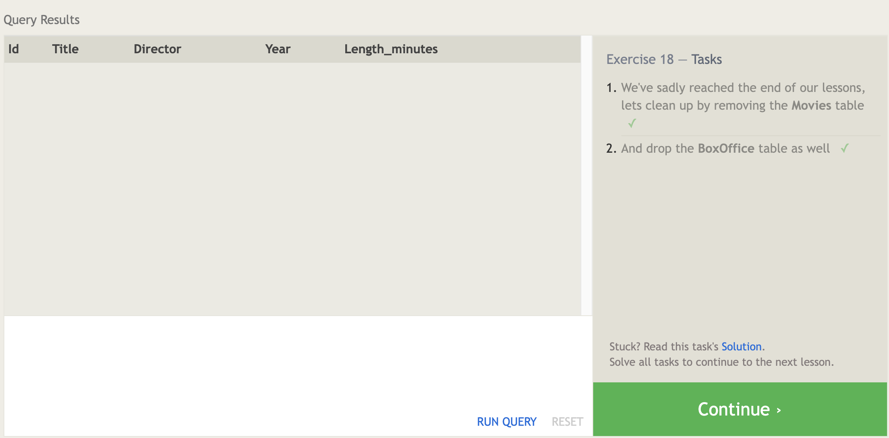

# Introduction to SQL

Source 
- https://sqlbolt.com/lesson/select_queries_introduction
- https://landing.chartio.com/download-learn-sql

## What is SQL?
SQL, is Structured Query Language. From my understanding SQL is a table based and relational database.

### SQL Lesson 1: SELECT queries 101

    Select query for a specific columns
    SELECT column, another_column, …
    FROM mytable;

    1 SELECT title FROM movies;
    2 SELECT director FROM movies;
    3 SELECT title, director FROM movies;
    4 SELECT title, year FROM movies;
    5 SELECT * FROM movies;

### SQL Lesson 2: Queries with constraints (Pt. 1)

Select query with constraints

    SELECT column, another_column, …
    FROM mytable
    WHERE condition
      AND/OR another_condition
      AND/OR …;
  
    1 SELECT id, title FROM movies 
      WHERE id = 6;
    2 SELECT title, year FROM movies
      WHERE year BETWEEN 2000 AND 2010;
    3 SELECT title, year FROM movies
      WHERE year < 2000 OR year > 2010;
    4 SELECT title, year FROM movies
      WHERE year <= 2003;

### SQL Lesson 3: Queries with constraints (Pt. 2)

    1 SELECT title, director FROM movies 
      WHERE title LIKE "Toy Story%";
    2 SELECT title, director FROM movies 
      WHERE director LIKE "John%";
    3 SELECT title, director FROM movies 
      WHERE director != "John Lasseter";
    4 SELECT * FROM movies 
      WHERE title LIKE "WALL-_";

### SQL Lesson 4: Filtering and sorting Query results

    SELECT query
    SELECT column, another_column, …
    FROM mytable
    WHERE condition(s)
    ORDER BY column ASC/DESC
    LIMIT num_limit OFFSET num_offset;

    1 SELECT DISTINCT director FROM movies
    ORDER BY director ASC;
    2 SELECT title, year FROM movies
      ORDER BY year DESC
      LIMIT 4;
    3 SELECT title FROM movies
      ORDER BY title ASC
      LIMIT 5;
    4 SELECT title FROM movies
      ORDER BY title ASC
      LIMIT 5 OFFSET 5;

### SQL Review: Simple SELECT Queries 

    1 SELECT city, population FROM north_american_cities
      WHERE country = "Canada";
    2 SELECT city, latitude FROM north_american_cities
      WHERE country = "United States"
      ORDER BY latitude DESC;
    3 SELECT city, longitude FROM north_american_cities
      WHERE longitude < -87.629798
      ORDER BY longitude ASC;
    4 SELECT city, population FROM north_american_cities
      WHERE country LIKE "Mexico"
      ORDER BY population DESC
      LIMIT 2;
    5 SELECT city, population FROM north_american_cities
      WHERE country LIKE "United States"
      ORDER BY population DESC
      LIMIT 2 OFFSET 2;

### SQL Lesson 6: Multi-table queries with JOINs

    Select query with INNER JOIN on multiple tables
    SELECT column, another_table_column, …
    FROM mytable
    INNER JOIN another_table 
    ON mytable.id = another_table.id
    WHERE condition(s)
    ORDER BY column, … ASC/DESC
    LIMIT num_limit OFFSET num_offset;

    1 SELECT title, domestic_sales, international_sales 
      FROM movies
        JOIN boxoffice
          ON movies.id = boxoffice.movie_id;
    2 SELECT title, domestic_sales, international_sales
      FROM movies
        JOIN boxoffice
          ON movies.id = boxoffice.movie_id
      WHERE international_sales > domestic_sales;
    3 SELECT title, rating
      FROM movies
        JOIN boxoffice
          ON movies.id = boxoffice.movie_id
      ORDER BY rating DESC;

### SQL Lesson 13: Inserting rows

    Insert statement with values for all columns
    INSERT INTO mytable
    VALUES (value_or_expr, another_value_or_expr, …),
           (value_or_expr_2, another_value_or_expr_2, …),…;

    1 INSERT INTO movies VALUES (4, "Toy Story 4", "El   Directore", 2015, 90);
    2 INSERT INTO boxoffice VALUES (4, 8.7, 340000000, 270000000);

### SQL Lesson 14: Updating rows

    Update statement with values
    UPDATE mytable
    SET column = value_or_expr, 
        other_column = another_value_or_expr, …
    WHERE condition;
    
    1 UPDATE movies
      SET director = "John Lasseter"
      WHERE id = 2;
    2 UPDATE movies
      SET Year = 1999
      WHERE id = 3;
    3 UPDATE movies
      SET Title = "Toy Story 3",
          Director = "Lee Unkrich"
      WHERE id = 11;

### SQL Lesson 15: Deleting rows

    Delete statement with condition
    DELETE FROM mytable
    WHERE condition;
    
    1 DELETE FROM movies
      WHERE year < 2005;
    2 DELETE FROM movies
      WHERE Director = "Andrew Stanton";

### SQL Lesson 16: Creating tables

    Create table statement w/ optional table constraint and default value
      CREATE TABLE IF NOT EXISTS mytable (
          column DataType TableConstraint DEFAULT default_value,
          another_column DataType TableConstraint DEFAULT default_value,…
      );

      Movies table schema
      CREATE TABLE movies (
          id INTEGER PRIMARY KEY,
          title TEXT,
          director TEXT,
          year INTEGER, 
          length_minutes INTEGER
      );

      1 CREATE TABLE Database (
            Name TEXT,
            Version FLOAT,
            Download_count INTEGER
        );

### SQL Lesson 17: Altering tables

    Altering table to add new column(s)
    ALTER TABLE mytable
    ADD column DataType OptionalTableConstraint 
        DEFAULT default_value;

    Altering table to remove column(s)
    ALTER TABLE mytable
    DROP column_to_be_deleted;

    Altering table name
    ALTER TABLE mytable
    RENAME TO new_table_name;

    1 ALTER TABLE Movies
      ADD COLUMN Aspect_ratio FLOAT DEFAULT 2.39;
    2 ALTER TABLE Movies
      ADD COLUMN Language TEXT DEFAULT "English";

### SQL Lesson 18: Dropping tables

    Drop table statement
    DROP TABLE IF EXISTS mytable;

    1 DROP TABLE IF EXISTS Movies;
    2 DROP TABLE IF EXISTS BoxOffice;

## Table Of Contents

- [GitHub Pages](https://github.com/harfrancois/401-reeading-notes)

- [The Command Line](./terminal.md)

- [Introduction to SQL](./SQL.md)