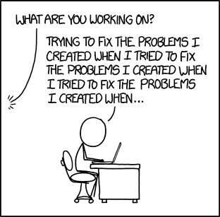

# Reading 4

### Classes and Objects
source - https://www.learnpython.org/en/Classes_and_Objects

Objects are an encapsulation of variables and functions into a single entity. 
Objects get their variables and functions from classes.

    class MyClass:
        variable = "blah"
    
        def function(self):
            print("This is a message inside the class.")

Assign class to an object.

        class MyClass:
        variable = "blah"
    
        def function(self):
            print("This is a message inside the class.")
    
        myobjectx = MyClass()

### Accessing Object Variables
        
        myobjectx.variable

Create multiple different objects that are of the same class. 

        class MyClass:
            variable = "blah"
        
            def function(self):
                print("This is a message inside the class.")
        
        myobjectx = MyClass()
        myobjecty = MyClass()
        
        myobjecty.variable = "yackity"
        
        # Then print out both values
        print(myobjectx.variable)
        print(myobjecty.variable)

### Accessing Object Functions

        myobjectx.function()

### init()
The __init__() function, is a special function that is called when the class is being initiated.

    class NumberHolder:
    
       def __init__(self, number):
       self.number = number

# Thinking Recursively in Python

iterative algorithm

    houses = ["Eric's house", "Kenny's house", "Kyle's house", "Stan's house"]
    
    def deliver_presents_iteratively():
        for house in houses:
            print("Delivering presents to", house)

### Recursive Functions in Python

A function will continue to call itself and repeat its behavior until some condition is met to return a result.

### Recursive Data Structures in Python

A data structure is recursive if it can be defined in terms of a smaller version of itself. A list is an example 
of a recursive data structure.

Starting with an empty list, you can generate any list by recursively applying the attach_head function.
Recursion can also be seen as self-referential function composition. We apply a function to an argument, 
then pass that result on as an argument to a second application of the same function, and so on. 
Repeatedly composing attach_head with itself is the same as attach_head calling itself repeatedly.

